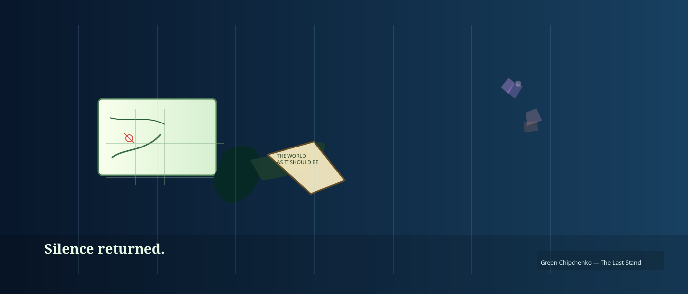

# Chapter 4 – The Last Stand of Green Chipchenko

The final battle began with a crash—specifically, his laptop’s operating system crashing in fear.

The ESRI Portal roared, a sound like corrupted shapefiles thrown into a blender. It unleashed swarms of unprojected geometries that spiraled through the air, distorting everything they touched.

Green braced himself. Cartography had always seemed a quiet, sensible profession. It had never occurred to him that he might one day wield it like a weapon.

But wield it he did.

He drew gridlines across the air, slicing through chaos. He deployed coordinate reference systems with the precision of a seasoned warrior. He summoned topology rules, enforcing **no gaps, no overlaps**, until the Portal shrieked under the pressure of integrity.

When the Portal lunged, he countered with a map he had crafted by hand—his masterpiece:  
**THE WORLD AS IT SHOULD BE**, annotated meticulously in his notebook.

He held it aloft. The Portal recoiled.

It was truth. Pure, spatial truth.

With a last surge of effort and a very undignified grunt, he shoved the correct geometry back into place.

The Portal collapsed like a poorly maintained geodatabase.

Silence returned.

